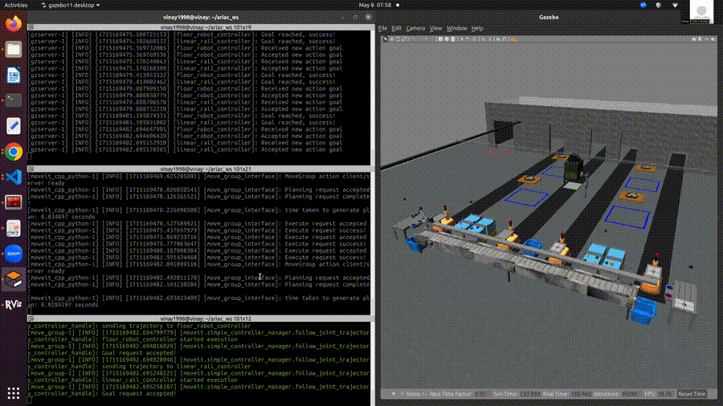

# ARIAC

The ARIAC (Agile Robotics for Industrial Automation Competition) , hosted by the National Institute of Standards and Technology (NIST), presents a rigorous platform for testing the agility and adaptability of robotic systems in dynamic manufacturing environments. This annual competition challenges participants to develop innovative solutions capable of performing a series of tasks, including pick-and-place operations, assembly, and kitting, within a simulated warehouse setting. More information about ARIAC can be found on [Official ARIAC Website](https://pages.nist.gov/ARIAC_docs/en/2023.5.0/index.html)


## Overview

Our project explores and addresses the core challenges posed by ARIAC, particularly focusing on the kitting task. Kitting involves the systematic gathering and arrangement of parts required for assembly processes. In our approach, we aim to develop a Competitor Control System (CCS) that performs the entire kitting process with precision and adaptability.

Our project addresses specific agility challenges inherent in the ARIAC competition.

1. High-Priority Order
2. Insufficient Parts
3. Correct Gripper
4. Faulty Parts
5. Faulty Gripper

By developing a robust robotics software system, our project aims to streamline the kitting process, ensuring seamless task execution while tackling the agility challenges in dynamic manufacturing environments. Through this endeavor, we seek to contribute to the advancement of agile robotics solutions, with potential applications across diverse industrial settings.

## Dependencies:
1. VS Code 
2. ROS2 - Galactic
3. Gazebo (Version : 11.0.0)
4. Ubuntu 20.04
5. Moveit & Rviz

## Package Structure and Overview: 

Our software development for the ARIAC competition utilizes both Python and C++, encapsulated within a ROS2 package structure. This structure ensures organized management of code and resources for efficient development and deployment. The package also includes sub package (robot_commander_msgs) which contains the custom services created to have efficient communication between C++ and Python nodes. The folders and files overview inside final_group1 is as below:

1. **config:** Stores YAML files containing sensor information to be spawned at the start of the ARIAC simulation.
2. **final_group1:** This folder contains all the Python and C++ code for ARIAC.
3. **include:** Contains C++ header files for the CCS (Competitor Control System) and OrderData class.
4. **launch:** Hosts the launch file used to initiate the package.
5. **src:** Houses C++ scripts responsible for implementing the functionality of the CCS.
6. **script:** Stores Python scripts for the CCS.
7. **rviz:** Holds the Rviz setup configuration, facilitating visualization if started from the launch file.
8. **CMakeLists.txt:** Configuration file specifying build instructions for the package.
9. **package.xml:** Metadata file providing information about the package and its dependencies.


## Instructions

- Make sure to have ROS2 Galactic installed on your system.
- Make a workspace by creating a folder named **ariac_ws**. Inside this folder create a folder called **src**. Clone the ariac package inside this workspace using below commands.
```bash
    cd ariac_ws
    git clone -b ariac2023 https://github.com/usnistgov/ARIAC.git src/ariac
```
- For any installation issues regarding moveit and rviz, please refer the official ARIAC website mentioned in the introduction
- Clone the package to the ariac workspace / copy the folder final_group1 into ariac_ws/src. Also make sure robot_commander_msgs folder is present with final_group1 in workspace src folder. Use commands below
```bash
    # In terminal 1
    cd ariac_ws/src
    git clone https://github.com/sshah115/enpm663_ariac.git
```
- Add the `final_spring2024.yaml` file to your `ariac_gazebo` present inside ariac folder package in `config/trails/`
- Build the workspace and source using following commands
```bash
    # Install YOLO library
    sudo pip install ultralytics
    # Source ros2
    source /opt/ros/galactic/setup.bash
    # Move to ariac directory
    cd ariac_ws 
    # To install all the dependencies
    rosdep install --from-paths src -y --ignore-src
    # Build all packages i.e. ariac and rwa because '.yaml' file has 
    # been added to ariac and a new package of rwa needs to be built.
    colcon build 
    # Source the workspace
    source install/setup.bash
```
- Ariac Running with Advanced Logical Cameras
    ### Terminal 1
    ```bash
        ros2 launch ariac_gazebo ariac.launch.py competitor_pkg:=final_group1 sensor_config:=sensors trial_name:=final_spring2024
    ```
    ### Terminal 2
    ```bash
        ros2 launch ariac_moveit_config ariac_robots_moveit.launch.py
    ```
    ### Terminal 3
    ```bash
        ros2 launch final_group1 final_group1.launch.py
    ```

    `Note`: Run the Command in terminal two after the statement `"You can now start the competetion!"` in Terminal 1.

- Ariac Running with Basic Logical Cameras
    ### Terminal 1
    ```bash
        ros2 launch ariac_gazebo ariac.launch.py competitor_pkg:=final_group1 sensor_config:=sensors_bonus trial_name:=final_spring2024
    ```
    ### Terminal 2
    ```bash
        ros2 launch ariac_moveit_config ariac_robots_moveit.launch.py
    ```
    ### Terminal 3
    ```bash
        ros2 launch final_group1 final_group1_bonus.launch.py
    ```

    `Note`: Run the Command in terminal two after the statement `"You can now start the competetion!"` in Terminal 1.

### Optional
- To run the codes place `ariac_group1.sh` or `ariac_group1_bonus.sh` in your workspace along with src, build, install folders and double click it to run the terminals.


## Results: 
You can see the ARIAC environment performing the task sequentially and the terminal 1 and terminal 3 displaying important updates. 

- The information about how each agility challenge is handled and implementation details can be found in [Final report](results/Final_Report.pdf)
- The Flow chart can be found [here](results/architecture.png)

The Video of the UR10 Arm picking up the part and placing on tray is shown below

<p align="center">

</p>

## Team Members:

1. Ankur Mahesh Chavan                   
2. Datta Lohith Gannavarapu 
3. Shail Kiritkumar Shah
4. Vinay Krishna Bukka
5. Vishnu Mandala

## Resources:
1. [https://pages.nist.gov/ARIAC_docs/en/latest/index.html](https://pages.nist.gov/ARIAC_docs/en/latest/index.html)
2. [ROS Galactic](https://docs.ros.org/en/galactic/index.html)
3. [Ultralytics](https://docs.ultralytics.com)
